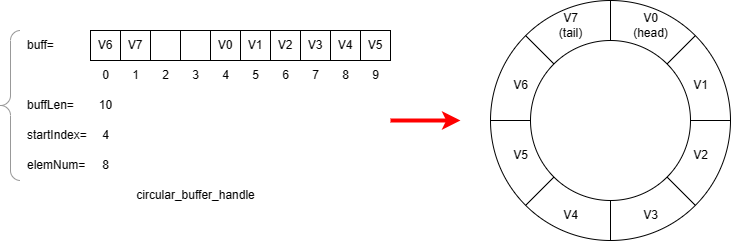

# Buffering utilities - bufferUtils.h/.c
This library implements two types of buffers: **plain** and **circular**, those buffers are represented by an handle structure (**plain_buffer_handle** and **circular_buffer_handle** respectively).
The handle structure contains a pointer to the actual buffer location in memory together with some metadata, as in the image below:

| **Member** | **Description** |
|------------|-----------------|
| buff       | Pointer to the memory array where the buffer is stored (classic C array) |
| buffLen | Number of bytes allocated for the buffer in memory (classic C array length) |
| elemNum | Number of valid elements currently present inside the buffer |
| startIndex | (only present on circular) Index inside memory array of the first valid element of circular buffer (buffer head) |

## Plain buffer
The plain buffer is basically a classic C array, the handle is useful to group the two typical values which are associated with an array: the length in memory and the number of elements currently present inside it. Data inside plain buffer will always start from the first physical index in the array and span for elemNum indexes, when elements are pulled or pushed into the buffer from the head, the memory array will be automatically shifted to respect this rule (computationally intensive).
When elements are pushed and the buffer gets full, no more bytes are pushed.
This type of buffer is best suited to be used as LIFO or as intermediate point between crude C array and circular buffer (conversion functions are provided).

## Circular buffer
The circular buffer on the other end can be pushed/pulled without moving the data inside it (computationally friendly), the circular buffer maps physical **memory indexes** to **virtual indexes**, for this reason it's well suited to implement efficient FIFOs; to do so, besides the metadata already present in plain buffers (buffLen and elemNum), it also has a startIndex number representing the index on the memory array where the buffer head (first byte) is located: the startIndex corresponds to the position of the buffer **virtual index** 0 in memory. The image below shows a circular_buffer_handle and the corresponding data structure.

Both types of buffers need to be initialized with the corresponding **<p/c>BuffInit()** function, the handle can then be passed to all the utility functions provided on the bufferUtils.h file, those functions can read, write, push, pull, rotate and flush; there are also functions to check if the buffer is empty (basically checking elemNum), functions to convert one type of buffer to the other and and to print buffers in human redable way.

Regarding conversion between buffers, the conversion from circular buffer to plain is performed by a memory rotation algorythm which has linear complexity with respect to memory array size instead of quadratic (as a basic byte-by-byte shift algorythm would have), allowing it to be used efficiently in a serial receiver (in this case the typical configuration is to use a circular fifo to buffer and analyze the serial stream and a plain buffer to output data packets to the user/upper layers, but the circular buffer is also well suited to be used as plain buffer by means of memory/virtual index translation functions available).

The library functions are provided as UTILITIES and not as complete interfaces: the philosophy was to avoid encapsulating the buffer structures completely with setter/getter functions, the user should be aware of the characteristics of those buffer structures (especially the easier circular buffers) and be able to direcly access its members to, for example, perform efficient computations on the memory array or get members values.

> [!NOTE]
> Right now, some plain buffer functions like write, read, push, pull are implemented as a specialization of circular ones, for this reason they are not maximally efficient (but easier to write and maintain).

