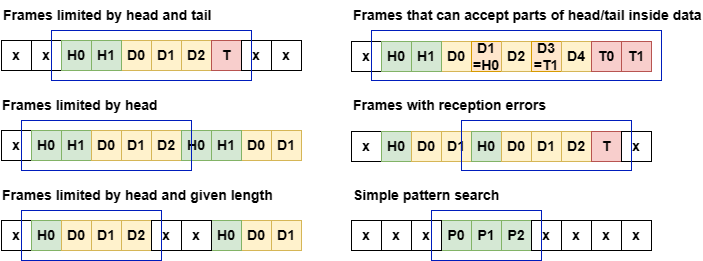
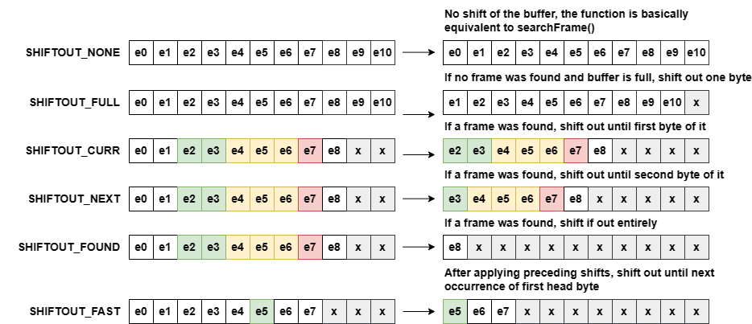
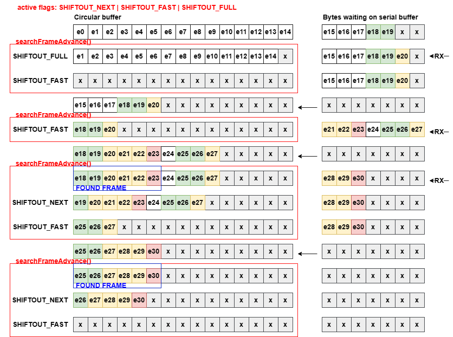

# Frame utilities - frameUtils.h/.c
This library implements complex functions to search various types of frame formats inside a serial stream buffered by a circular buffer of the bufferUtils submodule (https://github.com/shimo97/bufferUtils).

The library implements two major functions: searchFrame() and searchFrameAdvance(), which will be described in detail in the following sections.

## searchFrame()
This is the core functions which is actually used to search for a specific frame format inside the stream buffer, the frame format can be passed to the function by means of a structure containing search rules (**search_frame_rule**), allowing to detect various types of frames, with some examples being:

The rule structure contains the following members
| Member | Description |
| --- | --- |
| head | array containing the frame head sequence |
| headLen | length of head sequence |
| tail | array containing the frame tail sequence, can be NULL for frames without tail |
| tailLen | length of tail sequence, can be 0 for frames without tail |
| minLen | minimum frame length (head and tail excluded) |
| maxLen | maximum frame length (head and tail excluded), can be 0 to search without length bounds |
| policy | policy to apply if bytes that are part of head or tail sequences are found inside the frame (soft: complete head/tail sequences are allowed, medium: only non complete sequences are allowed, hard: no bytes being part of head nor tail is allowed)

The function accepts in input a stream circular buffer and the rule structure and outputs the eventually found frame into another circular buffer handle (by referece, NOT by copy!).

For more details, the function is highly documented inside the frameUtils.h header in Doxygen format.

## searchFrameAdvance()
This function uses searchFrame() as its core functions but enhances its capabilities with automatic buffer advance features:
the function has an interface quite similar to searchFrame() but it also accepts some flags that will make the stream buffer to automatically advance after each call to the function, according to the user needs.

The available flags are there explained:

Flags can be combined to mix their behavior, the user can then forget to pull bytes from the buffer, they will automatically advance by discarding older bytes to make room for newer ones coming from the serial stream, the user only needs to fill the buffer again (cBuffPushToFill() function of bufferUtils is advisable if the implementation requires to not overwite existing ones circularly).

For more details, the function is highly documented inside the frameUtils.h header in Doxygen format.

## Examples
An example program frameExample.c was given inside the examples folder, this program implements various examples of usage of searchFrameAdvance(), depending on the specific type of frame that we are trying to search for. The program prints the buffer content step-by-step, trying to give advice and tips against common problems that could arise due to errors on the serial stream or peculiar configurations of data.

Another step-by-step example is given in the image below, where the search of a classic packet starting with a two byte head (green) and a single byte tail (red) is performed, the example shows the behavior due to three flags by also showing when they have an effect on the stream buffer:
